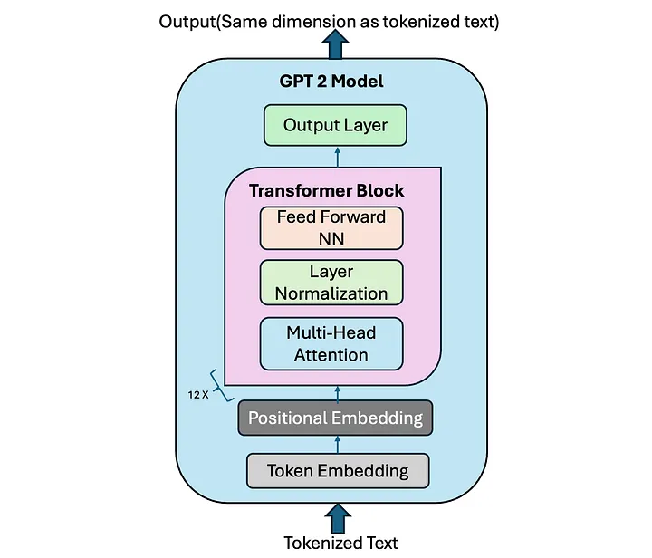

# Custom Spam Classifier — GPT-2 Built From Scratch


A **GPT-2 transformer model built entirely from scratch** in PyTorch, then fine-tuned as a binary spam classifier. No Hugging Face wrappers — every layer, every attention head, every normalization step is hand-coded and fully transparent.

---

## How It Works

This project takes a 124M-parameter GPT-2 architecture, implemented from the ground up, and repurposes it for spam detection through fine-tuning. The final output head is swapped from a vocabulary projection to a 2-class linear layer, and the model is trained to distinguish spam from legitimate messages.



```
Input Text
    │
    ▼
tiktoken (GPT-2 tokenizer)
    │
    ▼
Token + Positional Embeddings
    │
    ▼
┌─────────────────────────────────┐
│  Transformer Block  × 12        │
│  ┌───────────────────────────┐  │
│  │  Layer Norm               │  │
│  │  Multi-Head Self-Attention │  │
│  │  (12 heads, causal mask)  │  │
│  │  Dropout + Residual       │  │
│  │  Layer Norm               │  │
│  │  Feed Forward (GELU)      │  │
│  │  Dropout + Residual       │  │
│  └───────────────────────────┘  │
└─────────────────────────────────┘
    │
    ▼
Final Layer Norm
    │
    ▼
Linear Head (768 → 2 classes)
    │
    ▼
"spam" or "not spam"
```

---

## Architecture Deep Dive

### Multi-Head Self-Attention (`MultiHeadAttenModule.py`)
The core attention mechanism with causal masking — the model can only attend to past tokens, matching the original GPT-2 autoregressive design.

- Separate Q, K, V linear projections
- Heads are split via `view()` and `transpose()` — no separate per-head modules
- Scaled dot-product attention with causal mask filled as `-inf` before softmax
- Output projection recombines all heads

### GPT Model Stack (`gptModule.py`)

| Component | Implementation |
|---|---|
| `LayerNorm` | Custom, with learnable `scale` and `shift` parameters |
| `GELU` | Exact tanh approximation matching the original GPT paper |
| `FeedForward` | 2-layer MLP with 4× hidden dimension expansion |
| `TransformerBlock` | Pre-LayerNorm with residual connections (attention + FFN) |
| `GPTModel` | Token + positional embeddings → stacked blocks → output head |

### Spam Classifier (`spam_classifier_module.py`)
The GPT-2 model is adapted for classification by replacing the language model output head:

```python
# Original: Linear(768 → 50257 vocabulary)
# Fine-tuned: Linear(768 → 2 classes)
model.out_head = torch.nn.Linear(in_features=768, out_features=2)
```

Only the last token's logits are used for classification — a standard approach for decoder-only transformer classifiers.

---

## Supported Model Sizes

| Variant | Parameters | Embedding Dim | Layers | Heads |
|---|---|---|---|---|
| GPT-2 Small | 124M | 768 | 12 | 12 |
| GPT-2 Medium | 355M | 1,024 | 24 | 16 |
| GPT-2 Large | 774M | 1,280 | 36 | 20 |
| GPT-2 XL | 1,558M | 1,600 | 48 | 25 |

The classifier is trained on the **GPT-2 Small (124M)** variant.

---

## Quick Start

### 1. Clone the Repository
```bash
git clone https://github.com/your-username/CustomGPT2_SpamClassifier.git
cd CustomGPT2_SpamClassifier
```

### 2. Create and Activate a Virtual Environment
```bash
python3 -m venv venv
source venv/bin/activate        # macOS / Linux
# venv\Scripts\activate         # Windows
```

### 3. Install Dependencies
```bash
pip install -r requirements.txt
```

### 4. Download the Fine-Tuned Weights
Download `review_classifier_llm_finetuned_Nov_01.pth` from [my personal Google Drive](https://drive.google.com/file/d/164s6lTnNNZmfsIxnsYZf_qRwZ6GecUl_/view?usp=drive_link) and place it in the project root.

### Run the Classifier
```python
from spam_classifier_module import classify_review_response

spam_example = (
    "You are a winner you have been specially "
    "selected to receive $1000 cash or a $2000 award."
)

legit_example = (
    "Hey, just wanted to check if we're still on "
    "for dinner tonight? Let me know!"
)

print(classify_review_response(spam_example))   # → spam
print(classify_review_response(legit_example))  # → not spam
```

### Notebook Demo
Open `spam_classifier_llm.ipynb` for an interactive walkthrough of loading the model and running live classifications.

---

## Project Structure

```
CustomSpamClassifier/
├── MultiHeadAttenModule.py     # Multi-head self-attention with causal masking
├── gptModule.py                # Full GPT-2 architecture (LayerNorm, GELU, TransformerBlock, GPTModel)
├── spam_classifier_module.py   # Model loader + classify_review_response() API
└── spam_classifier_llm.ipynb   # Demo notebook
```

---

## Hardware

Inference runs on **Apple Silicon (MPS)** when available, with automatic fallback to CPU:

```python
device = torch.device("mps" if torch.backends.mps.is_available() else "cpu")
```

---

## Stack

- **PyTorch** — model architecture and inference
- **tiktoken** — OpenAI's GPT-2 BPE tokenizer (50,257 token vocabulary)
- **Apple MPS** — Metal Performance Shaders GPU acceleration
